# 1. Web应用程序处理流程
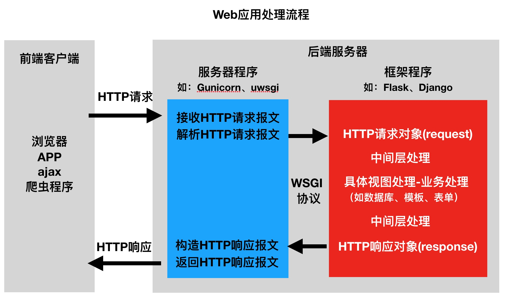

wsgi.py		连接  服务器和后台

## study step
- 如何搭建工程程序
  - 工程的组建
  - 工程的配置
  - 路由定义
  - 视图函数定义
- 如何获取请求数据(操作request对象)
- 如何构造响应数据(构造response对象)
- 如何使用中间层
- 框架提供的其他功能组件的使用
  - 数据库
  - 模板
  - 表单
  - admin
  
## Characteristic
1) 重量级框架

对比Flask框架,Django原生提供了众多的功能组件,让开发更简便快速。
  - 提供项目工程管理的自动化脚本工具( 脚手架工具 ) django-admin startproject project_name
  - 数据库ORM支持(对象关系映射,英语:Object Relational Mapping)
  - 模板
  - 表单
  - Admin管理站点
  - 文件管理
  - 认证权限
  - session机制
  - 缓存
  
2)MVC & MVT模式

有一种程序设计模式叫MVC, 其核心思想是分工、解耦,让不同的代码块之间降低耦合,增强代码的可扩展性和可移植
性,实现向后兼容。  

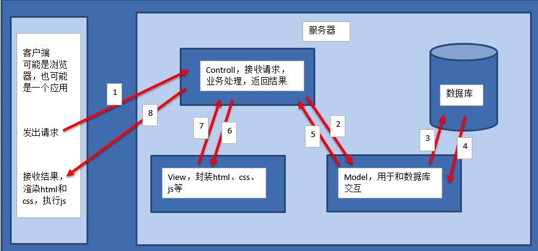  
  - M全拼为Model,主要封装对数据库层的访问,对数据库中的数据进行增、删、改、查操作。
  - V全拼为View,用于封装结果,生成⻚面展示的html内容。
  - C全拼为Controller,用于接收请求,处理业务逻辑,与Model和View交互,返回结果。  

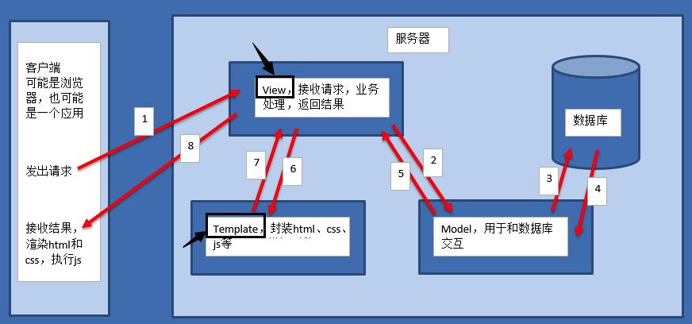  
  - M全拼为Model,与MVC中的M功能相同,负责和数据库交互,进行数据处理。
  - V全拼为View,与MVC中的C功能相同,接收请求,进行业务处理,返回应答。
  - T全拼为Template,与MVC中的V功能相同,负责封装构造要返回的html。
  - 注:
  - 差异就在于黑线黑箭头标识出来的部分
  - 具体差异不是很多,叫法和代码不同, 思路相同.  
  
https://docs.djangoproject.com/en/1.11/

https://github.com/django/django

# create virtual environment  

mkvirtualenv django_env -p python3

- -p : 制定使用的python解释器版本

install django

- pip install django==1.11.11

command of virtual environment

- virtualenvwrapper
```commandline
# 虚拟环境:
# 创建虚拟环境
mkvirtualenv
# 删除虚拟环境
rmvirtualenv
# 进入虚拟环境、查看所有虚拟环境
workon
# 退出虚拟环境
deactivate
```
```commandline
# pip:
# 安装依赖包
pip install
# 卸载依赖包
pip uninstall
# 查看已安装的依赖包
pip list
# 冻结当前环境的依赖包
pip freeze
```

# create a project

## 生成一个django项目工程的使用方式:
django-admin startproject 工程名称

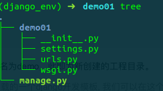

  - 与项目同名的目录,此处为demo。
  - settings.py 是项目的整体配置文件。
  - urls.py 是项目的URL配置文件。
  - wsgi.py 是项目与WSGI兼容的Web服务器入口。
  - manage.py 是项目管理文件,通过它管理项目。
  
## 1. 运行服务器命令如下:
- 我们可以运行django提供的建议运行服务器来运行我们添加的代码
python manage.py runserver IP地址:端口
- 如果IP地址和端口号不想指定,可以使用系统默认提供的127.0.0.1的ip地址和8000的端口号
- 上式就可以简写成:
python manage.py runserver 

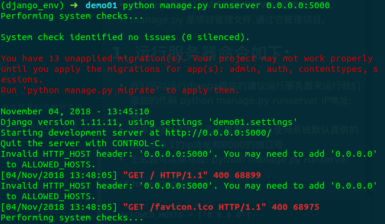

add to setting.py 
```python
ALLOWED_HOSTS = ['0.0.0.0'] 
```

visit on browser
0.0.0.0:5000

# Create app
python manage.py startapp appname

执行后,可以看到工程目录中多出了一个名为users的子目录。

一般一个子应用代表一个模块, 例如: 购物⻋模块, 支付模块, 商品展示模块等...
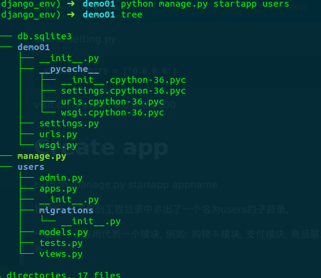

生成的子应用中各个文件的作用:
- admin.py 文件跟网站的后台管理站点配置相关。
- apps.py 文件用于配置当前子应用的相关信息。
- migrations 目录用于存放数据库迁移历史文件。
- models.py 文件用户保存数据库模型类。
- tests.py 文件用于开发测试用例,编写单元测试。
- views.py 文件用于编写Web应用视图。

## 3. 配置子应用
创建出来的子应用目录文件虽然被放到了工程项目目录中,但是django工程并不能立即直接使用该子应用,需要
注册安装后才能使用

- a. settings中默认的配置信息

settings文件里, installed_apps列表中工程默认配置的信息:
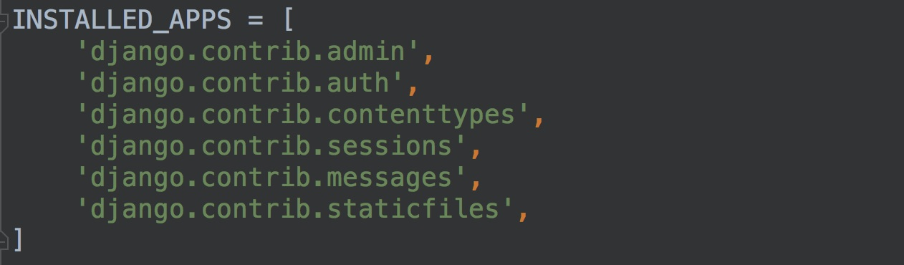

- b. 添加子应用到settings中
配置子应用信息也被称为: 注册安装一个子应用,
即, 将子应用的配置信息文件apps.py中的Config类添加到INSTALLED_APPS列表中。
例如:
将刚创建的users子应用中apps.py文件的信息( users.apps.UsersConfig ), 添加到INSTALLED_APPS中, 如图所示:


## 创建视图
同Flask框架一样,Django也用视图来编写Web应用的业务逻辑。

Django的视图是定义在子应用的views.py中的。

1. 创建

打开刚创建的users模块,在views.py中编写视图代码。
-  从django.http模块中导入HttpRespose
```python
from django.http import HttpResponse
def index(request):
"""
index视图
:param request: 包含了请求信息的请求对象
:return: 响应对象
"""
return HttpResponse("hello the world!")
'''
视图函数的第一个传入参数必须定义,用于接收Django构造的包含了请求数据的HttpReqeust对象,通常名
为request。
视图函数的返回值必须为一个响应对象,不能像Flask一样直接返回一个字符串,可以将要返回的字符串数据放到
一个HTTPResponse对象中。
'''
```

## 2. 定义路由URL
1) 在子应用中新建一个urls.py文件用于保存该应用的路由。
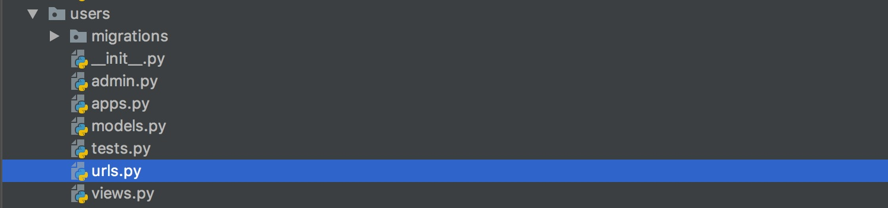

2) 在users/urls.py文件中定义路由信息。
```python
# 从urls模块中导入url
from django.conf.urls import url
# 从当前目录导入我们的视图模块views
from . import views
# urlpatterns是被django自动识别的路由列表变量
urlpatterns = [
# 每个路由信息都需要使用url函数来构造
# url(路径, 视图)
url(r'^index/$', views.index),
]
```

## 3) 在工程总路由demo/urls.py中添加子应用的路由数据。
```python
from django.conf.urls import url, include
from django.contrib import admin
urlpatterns = [
url(r'^admin/', admin.site.urls),
# django默认包含的,这个我们不用关心
# 把子路由信息添加到总路由中
url(r'^users/', include('users.urls')),
]
'''
使用include来将子应用users里的全部路由包含进工程路由中;
r'^users/' 决定了users子应用的所有路由都已/users/开头,如我们刚定义的视图index,其最终的完整访问路
径为/users/index/。
'''
```
include函数除了可以传递字符串之外,也可以直接传递应用的urls模块,如
```python
from django.conf.urls import url, include
from django.contrib import admin
import users.urls
# 先导入应用的urls模块
urlpatterns = [
url(r'^admin/', admin.site.urls),
# url(r'^users/', include('users.urls')),
# 除了上面的写法以外,我们还可以写成下面的形式, 如果写成下面的形式的话
# 需要导入当前的文件才可以
url(r'^users/', include(users.urls)),
# 添加应用的路由
]
```

# setting & static file & route
- a. 配置文件
1. BASE_DIR

当前工程的根目录,Django会依此来定位工程内的相关文件,我们也可以使用该参数来构造文件路径。
```python

BASE_DIR = os.path.dirname(os.path.dirname(os.path.abspath(__file__)))
___file___
: 可以理解为当前的文件
os.path.abspath ( 文件 ) : 获取这个文件的绝对路径
os.path.dirname( 路径 ) : 获取这个路径的上一级路径, 例如:
path1 = os.path.dirname( '/home/setttings.py' )
那么获取的结果为: path1 = '/home'
os.path.dirname( 路径 ) : 再次获取这个路径的下一级路径.
这样获取到的 BASE_DIR 其实就是当前项目的根目录.

```

- 2.DEBUG
设置是否为调试模式,创建工程后初始值为True,即默认工作在调试模式下。

调试模式的作用:

调试模式下django有个简易服务器在监听当前项目, 如果我们修改代码文件,服务器程序会自动重启, 重新加载修改
过的文件 ( 方便开发 )

当Django框架程序出现异常时,向前端(浏览器)显示详细的错误追踪信息,例如: ( 方便调试 )

注意:部署线上运行的Django不要运行在调式模式下,记得修改DEBUG=False。

- 3. 本地语言与时区

Django支持本地化处理,即显示语言与时区支持本地化。
本地化是将显示的语言、时间等使用本地的习惯,这里的本地化就是进行中国化,中国大陆地区使用简体中文,时区使
用亚洲/上海时区,注意这里不使用北京时区表示。
初始化的工程默认语言和时区为英语和UTC标准时区
```python
LANGUAGE_CODE = 'en-us'
TIME_ZONE = 'UTC'
# 语言: 英语
# 时区: 协调世界时,又称世界统一时间、世界标准时间、国际协调时间
将语言和时区修改为中国大陆信息
项目配置, 静态文件和路由
LANGUAGE_CODE = 'zh-hans'
TIME_ZONE = 'Asia/Shanghai'
```
- 注意:
  -  这里设置好时间之后, 我们需要把工程中添加的所有路径全部注释掉,才能够看到设置的中文效果生效.

  - 如果我们自己添加的路由信息不删除, 则django默认加载用户添加的信息, 进而不加载上面的界面, 换句话说, 如果你
  设置了路由, 则django不走它内部的默认⻚面, 而是走我们定义的路由界面,就看不到上面的中文画面了
  
- b.静态文件  
我们一般会把项目中的CSS、图片、js以及html等看做静态文件。

静态文件我们会放在一个静态(static)文件夹中, 统一管理

我们在html⻚面中调用时,需要指定静态文件的路径,故, Django中提供了一种用于配置静态文件路径的解析方
式。

静态文件可以放在项目根目录下,也可以放在应用的目录下,由于有些静态文件在项目中是通用的,所以推荐放

在项目的根目录下,方便管理。

为了提供静态文件访问路径,我们需要在项目的
settings.py

- 文件中配置两个参数:

STATICFILES_DIRS : 存放查找静态文件的目录

STATIC_URL : 访问静态文件的URL前缀

例如:
1) 在项目根目录下创建static_files目录来保存静态文件。
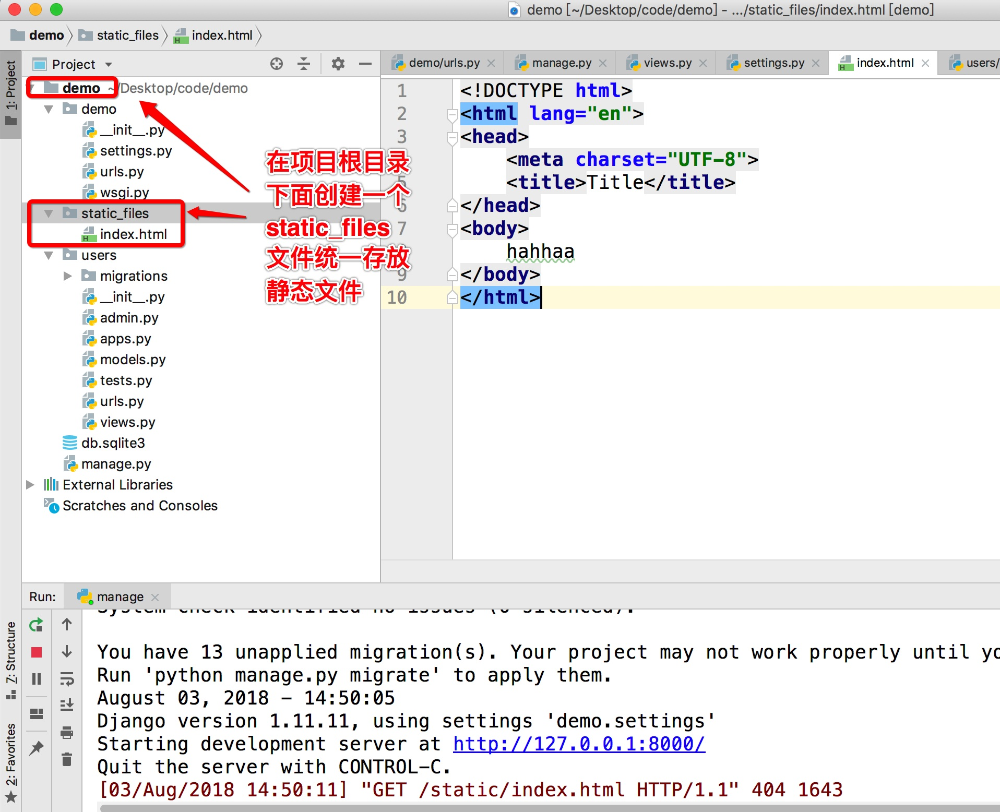

2) 在demo/settings.py中修改静态文件的两个参数为
```python
# 这个参数默认存在
STATIC_URL = '/static/'
# 我们可以添加这个参数, 用于补全静态文件路径
STATICFILES_DIRS = [
os.path.join(BASE_DIR, 'static_files'),
]
```

3)此时在static_files添加的任何静态文件都可以使用网址 /static/文件在static_files中的路径 来访问了。
例如:

我们向static_files目录中添加一个index.html文件,在浏览器中就可以使用127.0.0.1:8000/static/index.html来访
问:

或者我们在static_files目录中添加了一个子目录和文件goods/detail.html,在浏览器中就可以使用
127.0.0.1:8000/static/goods/detail.html来访问。

- 注意
Django 仅在调试模式下(DEBUG=True)能对外提供静态文件。

当DEBUG=False工作在生产模式时,Django不再对外提供静态文件,需要是用collectstatic命令来收集静态文件并交由
其他静态文件服务器来提供。(详细在部署时会讲)

## route
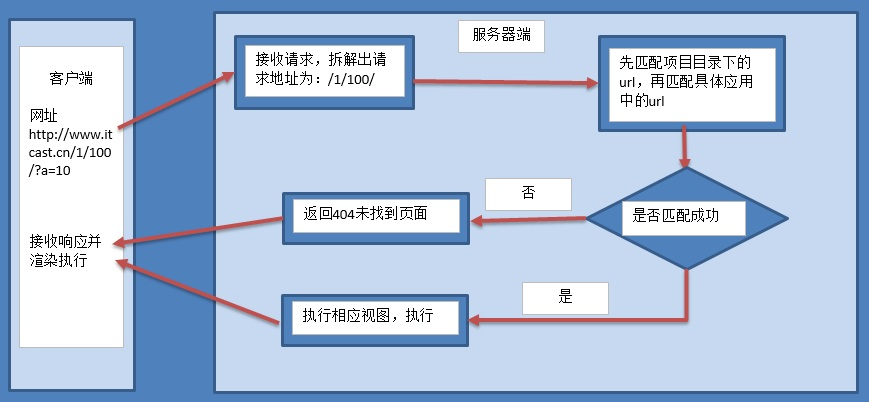

1. 路由定义位置

Django的主要路由信息定义在工程同名目录下的urls.py文件中,该文件是Django解析路由的入口。
每个子应用为了保持相对独立,可以在各个子应用中定义属于自己的urls.py来保存该应用的路由。然后用主路由
文件包含各应用的子路由数据。

除了上述方式外,也可将工程的全部路由信息都定义在主路由文件中,子应用不再设置urls.py。如:
```python
from django.conf.urls import url
from django.contrib import admin
# 导入子应用的视图模块
import users.views
urlpatterns = [
url(r'^admin/', admin.site.urls),
# 添加子应用的路由信息,对应所对应的子应用视图方法
url(r'^users/index/$', users.views.index)
]

```
2. 路由解析顺序
>Django在接收到一个请求时,从主路由文件中的urlpatterns列表中以由上至下的顺序查找对应路由规则,如果发
现规则为include包含,则再进入被包含的urls中的urlpatterns列表由上至下进行查询。

值得关注的由上至下的顺序,有可能会使上面的路由屏蔽掉下面的路由,带来非预期结果。例如:
```python
urlpatterns = [
url(r'^say', views.say),
url(r'^sayhello', views.sayhello),
]
```
即使访问sayhello/路径,预期应该进入sayhello视图执行,但实际优先查找到了say路由规则也与sayhello/路径匹配,实
际进入了say视图执行。

提示:

需要注意定义路由的顺序,避免出现屏蔽效应
```python
1. 调整书写顺序
from django.conf.urls import url
from . import views
urlpatterns = [
# 1. 调整书写顺序
url(r'^sayhello', views.sayhello),
url(r'^say', views.say)
]
第二种: recommand
2.调整正则书写方式:
from django.conf.urls import url
from . import views
urlpatterns = [
# 2.调整正则:
url(r'^say/$', views.say),
url(r'^sayhello/$', views.sayhello)
]
```

### 3. 路由命名与reverse反解析(逆向)
- 3.1 路由命名
在定义路由的时候,可以为路由命名,方便视图函数查找具体的某个路由。
1) 在使用include函数定义路由时,可以使用namespace参数定义路由的命名空间,如

url(r'^users/', include('users.urls', namespace='usersnamespace')),
命名空间表示,凡是users.urls中定义的路由,均属于namespace指明的users名下。
命名空间的作用:避免不同应用中的路由使用了相同的名字发生冲突,使用命名空间区别开。

2) 在定义普通路由时,可以使用name参数指明路由的名字,如
```python
urlpatterns = [
url(r'^index/$', views.index, name='indexname'),
url(r'^say', views.say, name='sayname'),
]
```

- 3.2 reverse反解析
在视图函数中, 我们可以根据reverse进行反解析,获取当前视图函数的路径. 如:
```python
# 注意导包路径, 把reverse导入文件,进行反解析
from django.core.urlresolvers import reverse
def index(request):
    return HttpResponse("hello the world!")
def say(request):
    url = reverse('usersnamespace:indexname')
    print(url)
# 打印: /users/in
```
- 对于未指明namespace的,reverse(路由name)
  - 例如:
  - 只指定了name='indexname', 没有指定namespace, 那么调用的时候可以写成:
  - url = reverse('indexname') 也可以获取到url的路径: /users/index/
- 对于指明namespace的,reverse(命名空间namespace:路由name)
  - 例如:
  - url(r'^users/', include(users.urls, namespace='indexnamespace'))
  - url(r'^index/$', views.index, name='indexname')
  - 使用reverse反解析: url = reverse('indexnamespace:indexname')
  - 最后获取的结果是: /users/index/

### 4. 路径结尾斜线
/
的说明
Django中定义路由时,通常以斜线/结尾,其好处是用户访问不以斜线/结尾的相同路径时,Django会把用户重定
向到以斜线/结尾的路径上,而不会返回404不存在。

例如:
```python
urlpatterns = [
    url(r'^index/$', views.index, name='index'),
]
用户访问 index 或者 index/ 网址,均能访问到index视图。
例如:
用
index/
发送请求的效果:
```
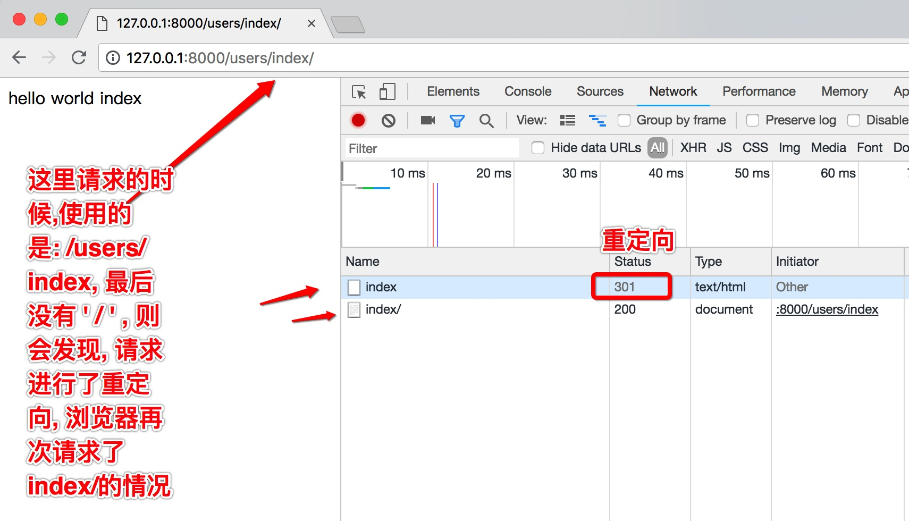

补充说明:

虽然路由结尾带/能带来上述好处,但是却违背了HTTP中URL表示资源位置路径的设计理念。
是否结尾带/以所属公司定义⻛格为准。

# App应用配置
在每个应用目录中都包含了apps.py文件,用于保存该应用的相关信息。

在创建应用时,Django会向apps.py文件中写入一个该应用的配置类,如
```python
from django.apps import AppConfig
class UsersConfig(AppConfig):
    name = 'users'
```
我们将此类添加到工程settings.py中的INSTALLED_APPS列表中,表明注册安装具备此配置属性的应用。
AppConfig.name 属性表示这个配置类是加载到哪个应用的,每个配置类必须包含此属性,默认自动生成。
AppConfig.verbose_name 属性用于设置该应用的直观可读的名字,此名字在Django提供的Admin管理站点中会显
示,如
```python
from django.apps import AppConfig
class UsersConfig(AppConfig):
    name = 'users'
    verbose_name = '用户管理'
```
所以: 一般我们会在 UsersConfig 文件中添加上 verbose_name 属性, 为admin管理站点提供应用的信息.

## review?

 different of flask and django?

## before and after
before:
ios
android
前端

after:
java
python
php
c/c++
node
.net

## transfer:
object <-> json <-> object

## 写新的frame:
口号(设计目的)
熟悉的语法规则(容易接受)，

## 库和框架
jquery:
封装的js函数库

库和框架:
小而精
大而全

## 模式:
单例
代理模式	（委托代理,)
观察者模式	（监听watch -变化-> notice)
mvc		 (界面和数据拼接可以在前/后端执行(分别是前后端分离和不分离))	
mvt
mvp

## 为什么使用这种设计模式?
解耦	(齿轮）
提高性能

### 解耦:
1. 引入A框架(api)
2. 文件b（函数in(调用A的api))
3. 调用自己封装的函数(而不是直接调用A的api)
，这样等不用A的时候(A不维护了),只需要修改文件b,不需要改变自身的业务逻辑，耦合度低

### vue用的是什么设计模式?
- introduction

简单小巧的核心，渐进式技术栈，足以应付任何规模的应用。

解偶视图与数据

可复用的组件

前端路由

状态管理

虚拟dom

- MVVM模式

与知名前端框架angular·ember等一样，vue.js在设计上也使用 mvvm模式。

mvvm模式是由经典的软件架构mvc衍生来的，当view（视图层）变化时，会自动更新到viewmodel（视图模型），反之亦然。view和viewmodel之间通过双向绑定建立联系，
- vue.js有什么不同

如果你使用过jquery，那你一i的那个对操作dom。绑定事件等这些原声javascript能力非常熟悉，比如我们在指定dom中插入一个元素，并给他绑定一个点击事件

这段代码不难理解，操作的内容也不复杂，不过这样让我们的视图代码和业务逻辑紧耦合在一起，随着功能不断增加，直接操作dom会使得代码越来越难以维护。

而vue.js通过mvvm的模式拆分为视图和数据两部分，并将其扽里，因此你只需关心你的数据就行，dom的事情vue会帮用vue.js可以改写为：
```html

<body>

<div id="app">

<button v-if="showBtn" v-on:click="handleClick“>click me</button>

</div>

</body>
```

## some learning method
笔记本 pc 手机　ipad 同步使用的笔记用来随时记忆知识点

记录知识点,为项目做准备(人的记忆不是万能的)

双屏开发:代码，笔记，

wiznote

## 框架:
register to be a developer (app key)

demo	example

manual	document

## 脚手架
vue命令行创建一个项目（脚手架)
类似
django-admin startproject demo_name

wsgi.py		连接  服务器和后台

## review
interviewer: 问什么问题，
think:      他到底想问什么
如果不会: 把答案给他套出来,弄懂
到下一家公司就可以谈: 我曾经遇到一个很难的问题，我给你讲一下

##前后端不分离:

爬虫不好爬取前后端不分离的项目, 因为他是再后端进行标签和数据拼接的，爬虫识别不了，

而且不解耦

## 文字编辑（文案）

## schedule
6.30下班
7晚餐
8班车
9点打车报销
10夜宵

锚点/路由


