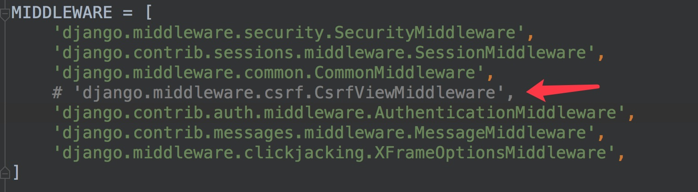
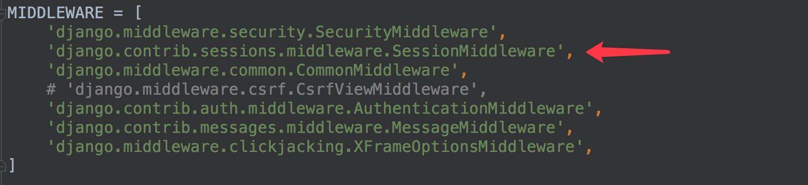
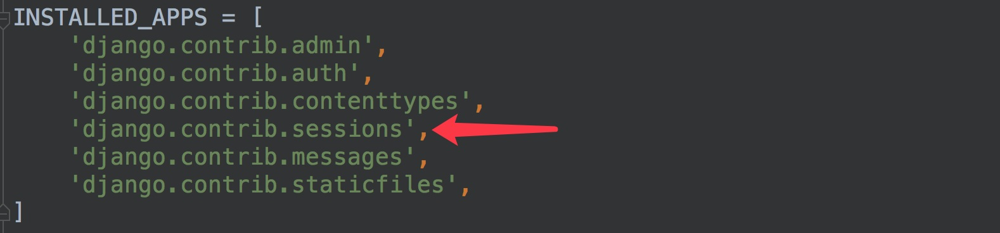
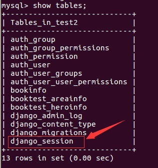
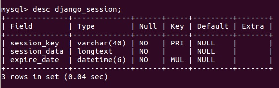
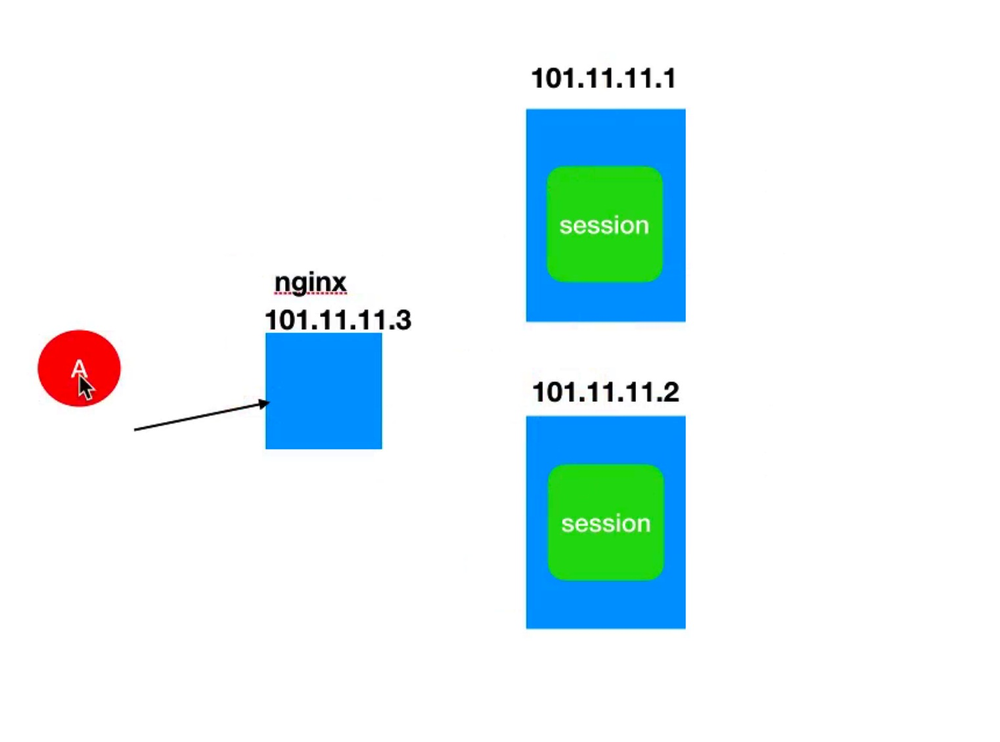
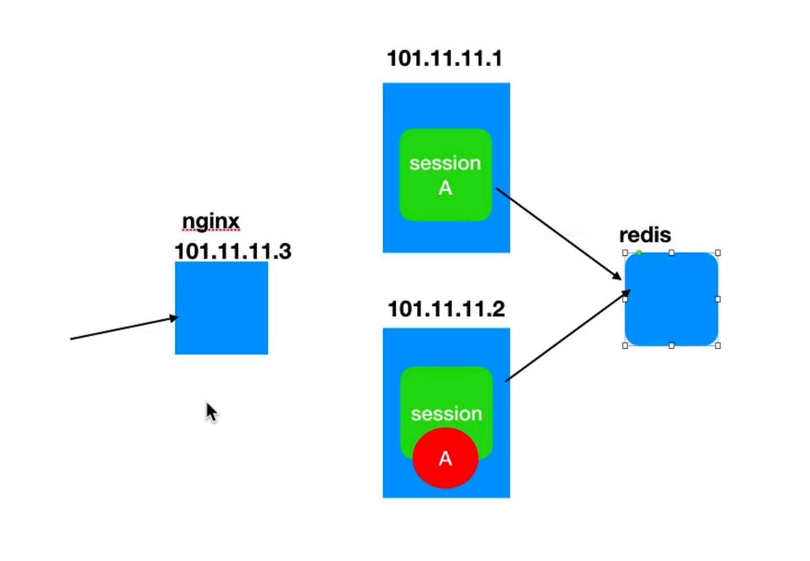
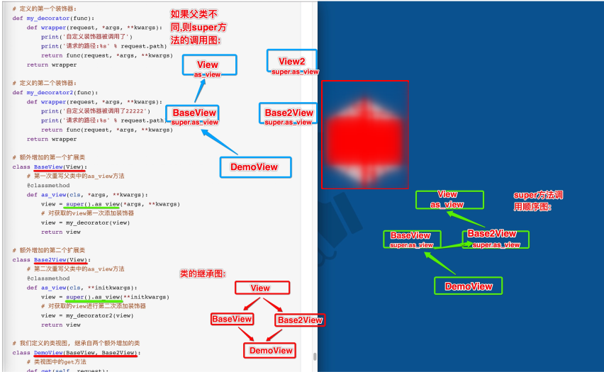
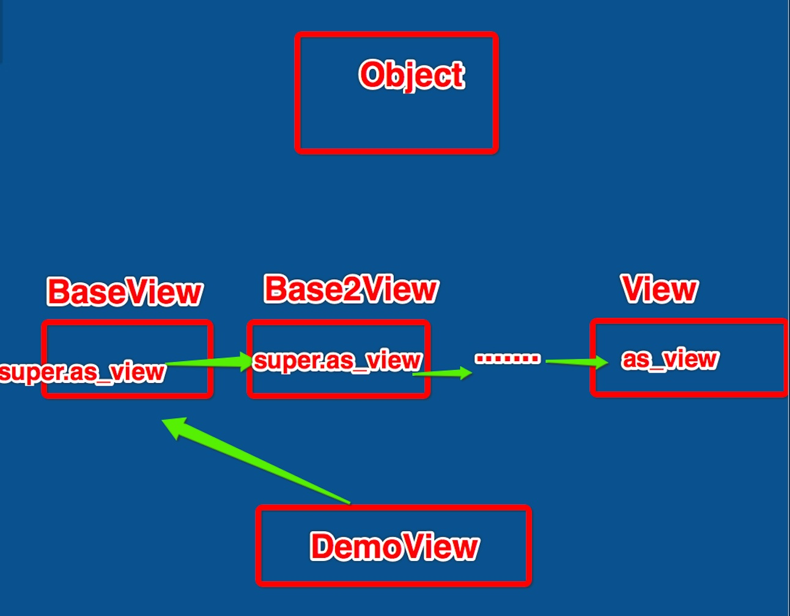
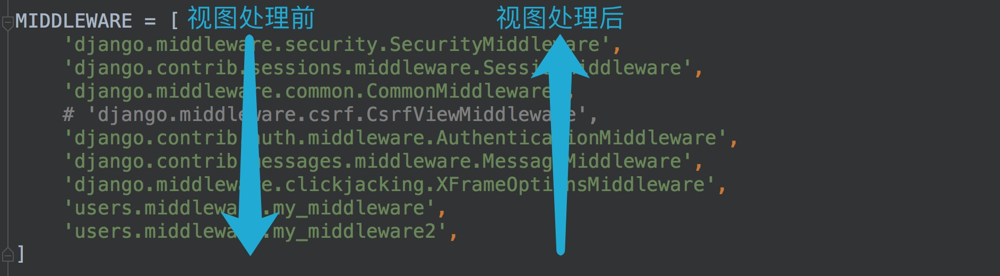

# 请求
提取URL的特定部分,如/weather/2018,可以在服务器端的路由中用正则表达式截取;

```html
// 前端发送请求:
$.ajax({
url:'http://www.baidu.com/weather/2018',
type:'get',
dataType:'json'
})
.done(function(data){
console.log(data)
})
.fail(function(error){
console.log(error)
})
```

```python
# flask后端接收数据:
# 使用正则转换器
# /user/weather/2018
@app.route('/user/weather/<re: userid>')
def index(userid):
return '%s' % userid
```

## URL路径参数

在定义路由URL时,可以使用正则表达式提取参数的方法从URL中获取请求参数,Django会将提取的参数直接传递到视
图的传入参数中。
- 未命名参数按定义顺序传递, 如
```python
url(r'^weather/([a-z]+)/(\d{4})/$', views.weather),
def weather(request, city, year):
print('city=%s' % city)
print('year=%s' % year)
return HttpResponse('OK')
```

- 命名参数按名字传递,如
```python
url(r'^weather/(?P<city>[a-z]+)/(?P<year>\d{4})/$', views.weather),
def weather(request, year, city):
print('city=%s' % city)
print('year=%s' % year)
return HttpResponse('OK')
```

## Django中的QueryDict对象
>django 中有一个 QueryDict 对象
 这个对象一般用来存储浏览器传递过来的参数

我们可以默认把他看成是一个字典
但是它和一般的字典的不同之处在于:

- QueryDict 这个字典可以用来处理一个键带有多个值得情况.
即: 一键 ===> 多值
- QueryDict 这个字典支持 get( ) 方法的使用:
- 这个位置需要区分是一键一值还是一键多值的不同情况:
  - 如果是一键一值:

QueryDict.get( key ) 获取的就是当前对应的值(value)
  - 如果是一键多值:

QueryDict.get( key ) 获取的就是最后一个值
  - QueryDict 还有一个所有值得方法:

QueryDict.getlist( key ) 获取这个键对应的所有值.

egg:

```python
get( ):
根据键获取值
如果一个键同时拥有多个值将获取最后一个值
如果键不存在则返回None值,可以设置默认值进行后续处理
# 默认值一般是default,可以省略
QueryDict.get('键',默认值)
# 或可写为:
QueryDict['键']

getlist( ):
根据键获取值,值以列表返回,可以获取指定键的所有值
如果键不存在则返回空列表[],可以设置默认值进行后续处理
dict.getlist('键',默认值)
```

## 查询字符串 (QueryString)
什么是查询字符串:

>简单理解: 就是请求地址中的参数部分, 我们统称为: 查询字符串( QueryString )
>获取请求路径中的查询字符串参数(形如?k1=v1&k2=v2)
>可以通过request.GET属性获取,这个方法返回QueryDict对象。

```html
// 前端发送请求:
$.ajax({
url:'http://127.0.0.1:8000/reqresp/qs/?a=1&b=2&a=3',
type:'get',
dataType:'json'
})
.done(function(data){
console.log(data)
// 打印: OK
})
.fail(function(error){
console.log(error)
})
```

```python
# python部分接收发送的参数并打印:
# 视图函数
def qs(request):
a = request.GET.get('a')
b = request.GET.get('b')
alist = request.GET.getlist('a')
print(a) # 3
print(b) # 2
print(alist)
# ['1', '3']
return HttpResponse('OK')
```

**重要:查询字符串不区分请求方式,即假使客户端进行POST方式的请求,依然可以通过request.GET获取请求中的查
询字符串数据。**

注意:
>这里的 request.GET 指的不是发送ajax用的get方法, 而是指从url的查询字符串中获取参数
同理: request.POST 指的也不是ajax用的post方法,而是我们从请求体中获取的参数
通过上面大家就能明白: GET 和 POST 这里指的都是获取参数的位置, 而不是我们以前说的get请求和post请求.

## 请求体
>请求体数据格式不固定,可以是表单类型字符串,可以是JSON字符串,可以是XML字符串,应区别对待。
<br>可以发送请求体数据的请求方式有 POST、PUT、PATCH、DELETE。

Django默认开启了CSRF防护,会对上述请求方式进行CSRF防护验证,在测试时可以关闭CSRF防护机制,方法为在
settings.py文件中注释掉CSRF中间件,如:


1. 表单类型 (Form Data)

前端发送的表单类型的请求体数据,可以通过request.POST属性获取,返回QueryDict对象。
我们又知道, QueryDict对象类似于一个字典, 所以我们可以通过get() 来获取 key 值所对应的 value 值
```python
def get_body(request):
    a = request.POST.get('a')
    b = request.POST.get('b')
    alist = request.POST.getlist('a')
    print(a)
    print(b)
    print(alist)
    return HttpResponse('OK')
```
>如果是表单数据, 发送的请求不但要求body中是表单的键值对,也要求请求头中content-type的类型是application/x-
www-form-urlencoded. 如果请求中的不是这样写的类型, 上面的request.POST.get( )方法也不可以使用.

- 2. 非表单类型 (Non-Form Data)
>非表单类型的请求体数据,Django无法自动解析
<br>可以通过request.body属性获取最原始的请求体数据,自己按照请求体格式(JSON、XML等)进行解析。
<br>其中: request.body返回bytes类型。

例如:
要获取请求体中的如下JSON数据
{"a": 1, "b": 2}

```python
def get_body_json(request):
    json_bytes = request.body
    json_str = json_bytes.decode()

    # python3.6及以上版本中, json.loads()方法可以接收str和bytes类型
    # 但是python3.5以及以下版本中, json.loads()方法只能接收str, 所以我们的版本如果是
    # 3.5 需要有上面的编码步骤.

    req_data = json.load(json_str)
    print(req_data['a'])
    print(req_data['b'])
    return HttpResponse('ok')

```

## 请求头
我们可以通过request.META属性获取请求头headers中的数据

request.META为字典类型。

这里需要注意一点是: 我们平常⻅到的请求头是这样的:
```html
POST /reqresp/req/ HTTP/1.1
Host: 127.0.0.1:8000
Content-Type: application/x-www-form-urlencoded
Cache-Control: no-cache
Postman-Token: dd531a45-7518-1e8f-63a5-be03ed593471
a=1&b=2&a=3
```

但是我们通过request.META获取的时候,需要使用如下所示的用法:
```html
CONTENT_LENGTH   – The length of the request body (as a string).
CONTENT_TYPE   – The MIME type of the request body.
HTTP_ACCEPT   – Acceptable content types for the response.

HTTP_ACCEPT_ENCODING – Acceptable encodings for the response.
HTTP_ACCEPT_LANGUAGE – Acceptable languages for the response.
HTTP_HOST    – The HTTP Host header sent by the client.
HTTP_REFERER   – The referring page, if any.
HTTP_USER_AGENT    – The client’s user-agent string.
QUERY_STRING    – The query string, as a single (unparsed) string.

REMOTE_ADDR – The IP address of the client.
REMOTE_HOST – The hostname of the client.
REMOTE_USER – The user authenticated by the Web server, if any.
REQUEST_METHOD   – A string such as "GET" or "POST"
SERVER_NAME – The hostname of the server.
SERVER_PORT – The port of the server (as a string)

```

```python
def get_headers(request):
    print(request.META['CONTENT_LENGTH'])
    print(request.META['CONTENT_TYPE'])
    return HttpResponse("ok")
```

## 其他常用的HttpRequest对象属性
    method:一个字符串,表示请求使用的HTTP方法,常用值包括:'GET'、'POST'。
    user:请求的用户对象。
    path:一个字符串,表示请求的⻚面的完整路径,不包含域名和参数部分。
    encoding:一个字符串,表示提交的数据的编码方式。
    如果为None则表示使用浏览器的默认设置,一般为utf-8。
    这个属性是可写的,可以通过修改它来修改访问表单数据使用的编码,接下来对属性的任何访问将使用新的
    encoding值。
    FILES:一个类似于字典的对象,包含所有的上传文件。

```python
def get_headers(request):
    print(request.META['CONTENT_LENGTH'])
    print(request.META['CONTENT_TYPE'])
    print()
    print(request.method)
    print(request.user)
    print(request.path)
    print(request.encoding)
    print(request.FILES)
    return HttpResponse("ok")
    '''
    POST
    AnonymousUser
    /reqresp/get_headers/
    None
    <MultiValueDict: {}>
    '''

```

# 响应
视图在接收请求并处理后,必须返回HttpResponse对象或子对象。
<br>HttpRequest对象由Django创建,HttpResponse对象由开发人员创建。

1. HttpResponse
可以从
django.http
里面导入
HttpResponse
我们可以给这个对象设置一些参数:
```html
使用方式:
HttpResponse(
content=响应体,
content_type=响应体数据类型,
status=状态码
)
```
- 自定义键值对
```python

# 定义一个新的视图函数
def demo_response(request):
    # 定义一个json字符串
    s = '{"name": "python"}'
    # 返回一个HttpResponse响应对象
    return HttpResponse(s, content_type="application/json", status=400)

```
2. HttpResponse子类
>Django提供了一系列HttpResponse的子类,可以快速设置状态码
这个状态码可以从
Django.http
里面导入,例如:
<br>from django.http import HttpResponseNotFound

```python
HttpResponseRedirect 301
HttpResponsePermanentRedirect 302
HttpResponseNotModified 304
HttpResponseBadRequest 400
HttpResponseNotFound 404
HttpResponseForbidden 403
HttpResponseNotAllowed 405
HttpResponseGone 410
HttpResponseServerError 500
```
```python
def getResponse(request):
    print(request.path)
    return HttpResponseNotFound('<h1>404 error</h1>')
```

3. JsonResponse
>如果我们要返回json字符串, 那么我们可以使用 JsonResponse 来帮助我们快速的构建json字符串,进行返回.
JsonResponse 能够帮助我们自动把字典转成json字符串类型, 并且还不用自己设置响应头中contentType字段

```python
def json_response(request):
    return JsonResponse({'city': 'beijin', 'subject': 'python'})
```

4. redirect重定向
```python
def redirect_response(request):
    return redirect('/static/error.html')
```

>建议redirect(重定向)和我们前面学习的reverse搭配使用.
尽量不要把路由写死. 有利于我们更改开发代码.

# Cookie
>Cookie,有时也用其复数形式Cookies,指某些网站为了辨别用户身份、进行session跟踪而储存在用户本地终端
上的数据(通常经过加密)。
<br>Cookie最早是网景公司的前雇员Lou Montulli在1993年3月的发明。
<br>Cookie是由服务器端生成,发送给User-Agent(一般是浏览器),浏览器会将Cookie的key/value保存到某个目
录下的文本文件内,下次请求同一网站时就发送该Cookie给服务器(前提是浏览器设置为启用cookie)。
<br>Cookie名称和值可以由服务器端开发自己定义,这样服务器可以知道该用户是否是合法用户以及是否需要重新登
录等。服务器可以利用Cookies包含信息的任意性来筛选并经常性维护这些信息,以判断在HTTP传输中的状态。
<br>Cookies最典型记住用户名。
<br>Cookie是存储在浏览器中的一段纯文本信息,建议不要存储敏感信息如密码,因为电脑上的浏览器可能被其它人
使用。

1. Cookie的特点
>Cookie以键值对的格式进行信息的存储。
<br>Cookie基于域名安全,不同域名的Cookie是不能互相访问的,google.com时向浏览器中写了Cookie信息,使用
同一浏览器访问baidu.com时,无法访问到google.com写的Cookie信息。
<br>当浏览器请求某网站时,会将浏览器存储的跟网站相关的所有Cookie信息提交给网站服务器。

2. 设置Cookie

可以通过HttpResponse对象中的set_cookie方法来设置cookie。

HttpResponse.set_cookie(cookie名, value=cookie值, max_age=cookie有效期)
>max_age 单位为秒,默认为None。browser reboot will not exist
如果是临时cookie,可将max_age设置为None。

```python
def set_cookies(request):
    response = HttpResponse('ok')
    # 临时cookies, browse close will not to save this cookie1
    response.set_cookie('python', 'yanxinyue', max_age=None)
    response.set_cookie('ruby', 'xiaojia', max_age=3600)  # one hour
    return response
```
3. 读取Cookie
可以通过HttpRequest对象的COOKIES属性来读取本次请求携带的cookie值。request.COOKIES为字典类型。
```python
def get_cookies(request):
    cookie1 = request.COOKIES.get('python', None)
    cookie2 = request.COOKIES.get('ruby', None)
    print(cookie1, cookie2)
    return HttpResponse('ok')
```

# Session
1. 启用Session
>简介:
<br>Session:在计算机中,尤其是在网络应用中,称为“会话控制”。Session 对象存储特定用户会话所需的属性及配置
信息。这样,当用户在应用程序的 Web ⻚之间跳转时,存储在 Session 对象中的变量将不会丢失,而是在整个
用户会话中一直存在下去。当用户请求来自应用程序的 Web ⻚时,如果该用户还没有会话,则 Web 服务器将自
动创建一个 Session 对象。当会话过期或被放弃后,服务器将终止该会话。Session 对象最常⻅的一个用法就是
存储用户的首选项。例如,如果用户指明不喜欢查看图形,就可以将该信息存储在 Session 对象中。注意 会话状
态仅在支持 cookie 的浏览器中保留。
<br>Django项目默认启用Session。

- Session的理解:
<br>广义来讲: session是一种会话机制, 用于记录多次http请求之间的关系,关系就是状态数据,比如登录状态.
<br>狭义来讲: session是一种会话数据, 记录的状态数据, 比如登录之后记录的user_id等.



2. 存储方式

在settings.py文件中,可以设置session数据的存储方式.
<br>另外session可以保存在数据库、本地缓存( 程序的运行内存中, 全局变量)、文件、redis等 。

2.1 数据库

存储在数据库中,如下设置可以写,也可以不写,这是默认存储方式。

```python
# 如果是存放数据库, 一般以db结尾
SESSION_ENGINE='django.contrib.sessions.backends.db'
```

如果存储在数据库中,需要在项INSTALLED_APPS中安装Session应用。






2.2 本地缓存

存储在本机内存中,如果丢失则不能找回,比数据库的方式读写更快。

```python
# 如果是存放在本地缓存, 一般以cache结尾
SESSION_ENGINE='django.contrib.sessions.backends.cache'
```

其中,本地缓存会出现问题: 因为是存放在本地的内存中,所以会出现在脱机情况下出现的跨机访问问题:

egg:
<br>我们这里可以看到: 有两台服务器存储的有session数据, 前面由nginx负责管理访问机制,有可能现在的访问方式是轮询形
式, 那么意味着第一次用户进入的是上面的服务器,进行了登录操作,我们把他的登录状态保存到了服务器1里面, 随后用户
有进行了其他操作, 然后有登陆进入这个服务器,这次轮询到了服务器2里面,但是这里面没有保存登录状态,这样就会造成
用户第二次登录.所以会造成用户跨机的问题.



但是如果我们使用redis就不会出现这样的情况,因为无论是哪一个服务器,最终存储的数据都保存到了redis中 :



2.3 混合存储

优先从本机内存中存取,如果没有则从数据库中存取。

```python
# 如果是存放数据库,一般以cached_db结尾
SESSION_ENGINE='django.contrib.sessions.backends.cached_db'
```

2.4 Redis
>参考文章: http://django-redis-chs.readthedocs.io/zh_CN/latest/#cache-backend

pip install django-redis

2)配置
```python
# setting
CACHES = {
    "default": {
        "BACKEND": "django_redis.cache.RedisCache",
        # 定义django中redis的位置
        "LOCATION": "redis://127.0.0.1:6379/1",
        "OPTIONS": {
            # django使用redis的默认客户端来进行操作.
            "CLIENT_CLASS": "django_redis.client.DefaultClient",
        }
    }}
# 我们定义一个cache(本地缓存来存储信息,cahe指定的是redis)
SESSION_ENGINE = "django.contrib.sessions.backends.cache"
# 本地的session使用的本地缓存名称是'default', 这个名称就是上面我们配置的caches的名
# 称"default"
SESSION_CACHE_ALIAS = "default"

```
```python
# Views.py:
def set_session(request):
    request.session['one'] = '1'
    request.session['two'] = '2'
    request.session['three'] = '3'
    return HttpResponse('保存session数据成功')


def get_session(request):
    one = request.session.get('one')
    two = request.session.get('two')
    three = request.session.get('three')
    text = 'one=%s, two=%s, three=%s' % (one, two, three)
    return HttpResponse(text)

```


3. Session操作

通过HttpRequest对象的session属性进行会话的读写操作。

1) 以键值对的格式写session。
request.session['键']=值
例如:
request.session['one'] = '1'

2)根据键读取值。
request.session.get('键')
例如:
one = request.session.get('one')

3)清除所有session,在存储中删除值部分。
request.session.clear()

4)清除session数据,在存储中删除session的整条数据。
request.session.flush()

5)删除session中的指定键及值,在存储中只删除某个键及对应的值。
del request.session['键']

6)设置session的有效期
request.session.set_expiry(value)

>如果value是一个整数,session将在value秒没有活动后过期。
<br>如果value为0,那么用户session的Cookie将在用户的浏览器关闭时过期。
<br>如果value为None,那么session有效期将采用系统默认值,默认为两周,可以通过在settings.py中设
置SESSION_COOKIE_AGE来设置全局默认值。其中 SESSION_COOKIE_AGE的单位是以秒为单位的.

# 类视图

类视图引入:

以函数的方式定义的视图称为函数视图,即我们常说的视图函数

但是:

视图函数遭遇不同方式分别请求( 例如 get 和 post ),并且需要做不同处理时, 我们如果在一个函数中编写不同的业
务逻辑, 代码可读性和复用性都不好.

例如:

##1. 我们创建一个新的子应用: demoview
python manage.py startapp demoview

```python
def indexview(request):
    # 获取请求方法,判断是GET/POST请求
    if request.method == 'GET':
        # 根据不同的请求方式,做不同的操作处理:
        return HttpResponse('indexview get func')
    else:
        # 根据不同的请求方式,做不同的操作处理:
        return HttpResponse('indexview post func')
```

上例虽然可以完成根据不同的请求进行不同处理的目的, 但是我们这样没有做到分离处理, get和post的处理方式还
是放在一个视图函数内部的, 而且也不利于我们后面内容的扩展.所以我们会对它进行改造:
在Django中给我们提供了类视图的概念.
即可以使用类来定义一个视图,解决上面的问题.

##2. 类视图使用

- 定义类视图, 且类视图继承自View
使用:
from django.views.generic import View
或者是:
from django.views.generic.base import View
- 定义路由, 路由的第二个参数需要是一个函数, 所以我们会调用系统的 as_view() 方法:
```python
urlpatterns = [
# 类视图:注册
    url(r'^register/$',views.RegisterView.as_view()),
]
```

```python
class RegisterView(View):
    def get(self, request):
        """处理GET请求,返回注册⻚面"""

        # return render(request, 'register.html')
        return HttpResponse('get registerview')

    def post(self, request):
        """处理POST请求,实现注册逻辑"""

        return HttpResponse('这里实现注册逻辑')
```

- 类视图的好处:
  - 代码可读性好
  - 类视图相对于函数视图有更高的复用性
    - 如果其他地方需要用到某个类视图的某个特定逻辑,直接继承该类视图即可

- 注意<br>
如果我们在类视图函数中没有定义方法, 但是我们请求了. 会报405找不到请求方法的错误.
<br>例如: 类视图中没有定义Get方法, 但是我们使用Get方法进行了请求, 那么会报405的错误: 找不到对应的请求方
法.
<br>在类视图中定义的 Get 或者是 POST 都是对象方法, 第一个参数都是self.
第二个参数一般情况下都是 request对象. 其他的参数依次往后面写就可以.
<br>我们在使用类视图的时候, 需要在路由位置进行设置, 设置的第二个参数需要是一个函数, 所以我们这里调用了类以后, 后面需要调用 as_view( ) 函数

##3. 类视图原理

```python
    @classonlymethod
    def as_view(cls, **initkwargs):
    '''
        cls 是as_view 接收的第一个参数，也就是调用当前函数的类，得到调用的类后，创建类对象self
    '''
        """
        Main entry point for a request-response process.
        """
    ...omission code...

        def view(request, *args, **kwargs):
            
            self = cls(**initkwargs)
            if hasattr(self, 'get') and not hasattr(self, 'head'):
                self.head = self.get
            # 给当前类添加对应的属性
            self.request = request
            self.args = args
            self.kwargs = kwargs
            # 调用dispatch 方法，根据不同的请求方式调用不同的请求方法
            return self.dispatch(request, *args, **kwargs)
        view.view_class = cls
        view.view_initkwargs = initkwargs

        # take name and docstring from class
        update_wrapper(view, cls, updated=())

        # and possible attributes set by decorators
        # like csrf_exempt from dispatch
        update_wrapper(view, cls.dispatch, assigned=())
        # 返回真正的视图函数
        return view

    # dispatch本身是分发的意思,这里指的是函数的名字.
    def dispatch(self, request, *args, **kwargs):
        # Try to dispatch to the right method; if a method doesn't exist,
        # defer to the error handler. Also defer to the error handler if the
        # request method isn't on the approved list.
        if request.method.lower() in self.http_method_names:
        
            # 如果在里面, 则进入这里
            # 这里的getattr作用是获取当前对象的属性.
            # 下面的参数为:
            # self : 类视图对象
            # request.method.lower() : 请求方法的小写. 例如: 'get' 或 'post'
            # http_method_not_allowed : 后续处理方式(不允许请求)
            # 下面代码整体的意思: 根据类视图对象, 获取当前类视图中对应名称的方法
            # 如果获取到, 则把方法返回给handle, 否则不允许访问.
            handler = getattr(self, request.method.lower(), self.http_method_not_allowed)
        else:
        # 如果类视图中如果没有的话, 则进入这里, 表明不允许进行请求.
# 我们会把不允许请求这个字段返回给handle.
            handler = self.http_method_not_allowed
        return handler(request, *args, **kwargs)
```

##4. 类视图使用装饰器
为了理解方便,我们先来定义一个为函数视图准备的装饰器(在设计装饰器时基本都以函数视图作为考虑的被装
饰对象),以及一个要被装饰的类视图, 来说明一下给类添加装饰器的实现要点.

### method1
```python
# 导入views.py视图文件
from . import views
urlpatterns = [
# 我们在路由部分, 把定义好的装饰器添加到当前的函数上
# 这里需要注意: as_view() 会返回一个 view() 函数
# 所以我们把装饰器添加到view()函数上.
url(r'^demo/$', views.my_decorate(views.DemoView.as_view()))
]
```

```python
from django.views.generic.base import View
# func = my_decorator(func)
def my_decorator(func):
    # wrapper函数必然会接收一个request对象,因为传入进来的func这个函数肯定会带这个参数
    def wrapper(request, *args, **kwargs):
        print('自定义装饰器被调用了')
        print('请求路径%s' % request.path)
        return func(request, *args, **kwargs)

    return wrapper

class DemoView(View):
    def get(self, request):
        """处理GET请求,返回注册⻚面"""
        print('get method')
        # return render(request, 'register.html')
        return HttpResponse('get registerview')

    def post(self, request):
        """处理POST请求,实现注册逻辑"""
        print('post method')
        return HttpResponse('这里实现注册逻辑')
# 1. 此种方式最简单,但因装饰行为被放置到了url配置中,单看视图的时候无法知道此视图还被添加了装饰器,
# 不利于代码的完整性,不建议使用。
# 2. 此种方式会为类视图中的所有请求方法都加上装饰器行为(因为是在视图入口处,分发请求方式前)
```

### method2
```python
    # or use 类视图
    # 给类视图增加上@method_decorator方法
    # 增加上之后,并不能够给其中的某一个函数增加上装饰器
    # 所以我们需要给method_decator配置第二个参数
    # 第二个参数就是类中某一个函数的名称. 意味着给当前这个函数增加上装饰器.
    # @method_decorator(my_decorator, name='dispatch')
    class DemoView(View):
             # 重写父类的dispatch方法, 因为这个方法被 as_view() 中的 view() 调用
        # 所以我们对这个方法添加装饰器, 也就相当于对整个类视图的方法添加装饰器.
    @method_decorator(my_decorator)
    def dispatch(self, request, *args, **kwargs):
        # 重写父类的这个方法我们不会修改它的任何参数, 所以我们直接调用父类的这个方法即可
        # 它里面的参数我们也不动它, 直接还传递过去.
        return super().dispatch(request, *args, **kwargs)    
        
        def get(self, request):
            """处理GET请求,返回注册⻚面"""
            print('get method')
            # return render(request, 'register.html')
            return HttpResponse('get registerview')
    
        def post(self, request):
            """处理POST请求,实现注册逻辑"""
            print('post method')
            return HttpResponse('这里实现注册逻辑')

```

### method3
```python
def my_decorator(func):
    def wrapper(self, request, *args, **kwargs):
        # 此处增加了self
        print('自定义装饰器被调用了')
        print('请求路径%s' % request.path)
        return func(self, request, *args, **kwargs)
        # 此处增加了self
    return wrapper
```

### method4 构造Mixin扩展类

```html
类视图 —————> 继承自View类 (包含有as_view函数)
如果我们在整个继承的过程中添加一步, 例如:
类视图 ———> 继承自额外扩展的类 ———> 继承自View类(包含有as_view函数)

如果我们在额外扩展的类中, 重写 as_view( ) 方法, 并且对 as_view( ) 方法添加装饰器, 那么我们会发现, 类
视图中的所有方法都会被装饰器装饰. 故, 我们要实现这一点, 需要分为两步:
第一步: 创建一个扩展类, 并且让类视图继承自该类.
第二步: 在扩展类中重写 as_view 方法,并且给该方法,添加装饰器
```
```python
class BaseView(View):
# 在扩展类中,重写View类的 as_view 方法, 并且对该方法添加装饰器.
    @classmethod
    def as_view(cls, *args, **kwargs):
        # 重写之后, 不对该方法做其他额外操作,所以我们重新调用父类的该方法.
        view = super().as_view(*args, **kwargs)
        # 对父类传过来的view方法添加装饰器.
        view = my_decorator(view)
        return view
```

```python
# 让我们的类视图继承自扩展类
class DemoView(BaseView):
    def get(self, request):
        print('get')
        return HttpResponse('get func')
    def post(self, request):
        print('post')
        return HttpResponse('post func')
```

### method4 extend

类视图 —————> 继承自View类 (包含有as_view函数)

类视图 ———> 继承自额外扩展的类1 ---> 继承自额外扩展的类2 ———> 继承自View类(包含有as_view函数)
```python
def my_decorator(func):
    # wrapper函数必然会接收一个request对象,因为传入进来的func这个函数肯定会带这个参数
    def wrapper(request, *args, **kwargs):
        print('自定义装饰器被调用了')
        print('请求路径%s' % request.path)
        return func(request, *args, **kwargs)

    return wrapper


def my_decorator2(func):
    def wrapper(request, *args, **kwargs):
        print('decorator2自定义装饰器被调用了')
        print('请求路径%s' % request.path)
        return func(request, *args, **kwargs)

    return wrapper


class BaseView(View):
    @classmethod
    def as_view(cls, *args, **kwargs):
        view = super().as_view(*args, **kwargs)
        view = my_decorator(view)
        return view


class BaseView2(View):
    @classmethod
    def as_view(cls, *args, **kwargs):
        view = super().as_view(*args, **kwargs)
        view = my_decorator2(view)
        return view


class RegisterView(BaseView, BaseView2):
    # 先调用BaseView, then BaseView2
    def get(self, request):
        print('get')

        return HttpResponse('get func')

    def post(self, request):
        print('post')

        return HttpResponse('post func')

'''爷爷类相等
demoview
baseview
base2view
view
as view 找到as view 算是头
super as view
super as view
demoview
'''
```


如果两个扩展类的父类相同: 则两个父类都会调用

如果两个扩展类的父类不同: 则只会调用第一个父类

```python

class BaseView(object):
    @classmethod
    def as_view(cls, *args, **kwargs):
        view = super().as_view(*args, **kwargs)
        view = my_decorator(view)
        return view


class BaseView2(object):
    @classmethod
    def as_view(cls, *args, **kwargs):
        view = super().as_view(*args, **kwargs)
        view = my_decorator2(view)
        return view


class RegisterView(BaseView, BaseView2, View):
    # 先调用BaseView, then BaseView2
    def get(self, request):
        print('get')

        return HttpResponse('get func')

    def post(self, request):
        print('post')

        return HttpResponse('post func')

```
因为都是继承自object,所以扩展类中的super.as_view都会去找其他的父类依次执行,最终都会执行到View这个类这
里, 所以肯定会执行View中的as_view方法



使用Mixin扩展类,也会为类视图的所有请求方法都添加装饰行为

# 中间件

Django中的中间件是一个轻量级、底层的插件系统,可以介入Django的请求和响应处理过程,修改Django的输入或输
出。中间件的设计为开发者提供了一种无侵入式的开发方式,增强了Django框架的健壮性。
>一个客户端的代码可能包含框架和客户端自己的功能
<br>浸入式设计，就是设计者将框架的功能"推" 给客户端，而非侵入式，则设计者将客户端的功能"拿"到框架中用
<br>侵入式设计有时候表现为客户段需要继承框架中的类，而为侵入式设计则表现为客户端实现框架提供的接口
<br>侵入式缺陷：当你决定重构代码时，发想之前写过的代码只能扔掉

我们可以使用中间件,在Django处理视图的不同阶段对输入或输出进行干预。

-  中间件的定义方法

>定义分为三步:
1. 在一个子应用中创建一个中间件文件. 例如: middleware(别的名字也可以)
2. 在setting.py文件的MIDDLEWARE部分注册添加.
3. 在调用视图时,便会调用中间件了.

>定义一个中间件工厂函数,然后返回一个可以调用的中间件。
<br>中间件工厂函数需要接收一个可以调用的get_response对象。
<br>返回的中间件也是一个可以被调用的对象,并且像视图一样需要接收一个request对象参数,返回一个response对象。

```python
# 中间件模板:
def simple_middleware(get_response):
    # 此处编写的代码仅在Django第一次配置和初始化的时候执行

    def middleware(request):
        # 在此编写的代码会在每个请求处理视图前被调用
        response = get_response(request)
        # 此处编写的代码会在每个请求处理视图之后被调用
        return response

    return middleware

    pass

```

例如,在users应用中新建一个middleware.py文件
```python
def my_middleware(get_response):
    # 此处编写的代码仅在Django第一次配置和初始化的时候执行
    print('init called')

    def middleware(request):
        # 在此编写的代码会在每个请求处理视图前被调用
        print('before request called')
        response = get_response(request)
        # 此处编写的代码会在每个请求处理视图之后被调用
        print('after response called')
        return response

    return middleware


```
定义好中间件后,需要在settings.py 文件中添加注册中间件
```python
MIDDLEWARE = [
    'django.middleware.security.SecurityMiddleware',
    'django.contrib.sessions.middleware.SessionMiddleware',
    'django.middleware.common.CommonMiddleware',
    # 'django.middleware.csrf.CsrfViewMiddleware',
    'django.contrib.auth.middleware.AuthenticationMiddleware',
    'django.contrib.messages.middleware.MessageMiddleware',
    'django.middleware.clickjacking.XFrameOptionsMiddleware',
    'users.middle.my_middleware',  # add middleware
]
```
定义一个视图进行测试

```python
def demo_view(request):
print('view 视图被调用')
return HttpResponse('OK')
```
Solution
```html
Django version 1.11.11, using settings 'demo02.settings'
Starting development server at http://127.0.0.1:8000/
Quit the server with CONTROL-C.
init called
init called
[08/Nov/2018 05:44:06] "GET /users/test_middle/ HTTP/1.1" 200 2
before request called
demo_view are called
after response called
注意:Django运行在调试模式下,中间件init部分有可能被调用两次
```

## 多个中间件的执行顺序
在请求视图被处理前,中间件由上至下依次执行

在请求视图被处理后,中间件由下至上依次执行



Solution
```html
init2 被调用
init 被调用
[08/Nov/2018 06:28:45] "GET /users/test_middle HTTP/1.1" 301 0
before request called
before request 2 called
demo_view are called
after response 2 called
after response called
[08/Nov/2018 06:28:45] "GET /users/test_middle/ HTTP/1.1" 200 2
```


# summary

redirect需要写全（总  ＋　子）
